# ER図 - 学生アルバイト勤怠管理システム（楽工）

```mermaid
erDiagram
    %% ========== ユーザー・権限管理 ==========
    users["users<br/>(ユーザー)"] {
        bigint id PK "主キー"
        varchar email UK "メールアドレス(一意制約)"
        varchar first_name "名"
        varchar last_name "姓"
        enum status "ユーザー状態(pending,active,inactive)"
        varchar google_uid "Google OAuth識別子"
        bigint department_id FK "所属部署ID"
        date contract_start_date "契約開始日"
        date contract_end_date "契約終了日"
        timestamp contract_updated_at "契約更新日時"
        bigint contract_updated_by_id FK "契約更新者ID"
        timestamp created_at "作成日時"
        timestamp updated_at "更新日時"
    }

    departments["departments<br/>(部署)"] {
        bigint id PK "主キー"
        varchar name "部署名"
        enum type "部署種別(一般,労務,管理)"
        text description "部署説明"
        timestamp created_at "作成日時"
        timestamp updated_at "更新日時"
    }

    roles["roles<br/>(権限)"] {
        bigint id PK "主キー"
        enum name "権限名(学生,部署管理者,労務,システム管理者)"
        varchar description "権限説明"
        timestamp created_at "作成日時"
        timestamp updated_at "更新日時"
    }

    user_roles["user_roles<br/>(ユーザー権限)"] {
        bigint id PK "主キー"
        bigint user_id FK "ユーザーID"
        bigint role_id FK "権限ID"
        timestamp created_at "作成日時"
        timestamp updated_at "更新日時"
    }

    %% ========== 週中心シフト管理 ==========
    weeks["weeks<br/>(週マスター)"] {
        bigint id PK "主キー"
        date start_date UK "週開始日(月曜日、一意制約)"
        date end_date "週終了日(日曜日)"
        int year "年"
        int week_number "週番号(1-53)"
        boolean is_cross_month "月跨ぎ週フラグ"
        timestamp created_at "作成日時"
        timestamp updated_at "更新日時"
    }

    weekly_shifts["weekly_shifts<br/>(週別シフト)"] {
        bigint id PK "主キー"
        bigint user_id FK "ユーザーID"
        bigint week_id FK "週ID"
        int submission_month "提出対象月"
        int submission_year "提出対象年"
        enum status "ステータス(draft,submitted)"
        json violation_warnings "制限違反警告内容(JSON形式)"
        timestamp submitted_at "提出日時"
        timestamp created_at "作成日時"
        timestamp updated_at "更新日時"
    }

    daily_schedules["daily_schedules<br/>(日別スケジュール)"] {
        bigint id PK "主キー"
        bigint weekly_shift_id FK "週別シフトID"
        date schedule_date "対象日"
        string company_start_time "弊社勤務開始時間(HH:MM形式、文字列)"
        string company_end_time "弊社勤務終了時間(HH:MM形式、文字列)"
        string sidejob_start_time "掛け持ち開始時間(HH:MM形式、文字列)"
        string sidejob_end_time "掛け持ち終了時間(HH:MM形式、文字列)"
        decimal company_actual_hours "弊社実労働時間"
        decimal sidejob_actual_hours "掛け持ち実労働時間"
        timestamp created_at "作成日時"
        timestamp updated_at "更新日時"
    }

    monthly_summaries["monthly_summaries<br/>(月次集約)"] {
        bigint id PK "主キー"
        bigint user_id FK "ユーザーID"
        int year "対象年"
        int month "対象月"
        decimal total_company_hours "月間自社労働時間"
        decimal total_sidejob_hours "月間掛け持ち労働時間"
        decimal total_all_hours "月間合計労働時間"
        enum status "ステータス(draft,submitted)"
        timestamp submitted_at "提出日時"
        timestamp created_at "作成日時"
        timestamp updated_at "更新日時"
    }

    %% ========== 実績管理（勤怠・申請） ==========
    time_records["time_records<br/>(打刻履歴)"] {
        bigint id PK "主キー"
        bigint user_id FK "ユーザーID"
        date date "勤務日"
        enum type "打刻種別(clock_in,break_start,break_end,clock_out)"
        timestamp punched_at "打刻時刻"
        int break_sequence "休憩回数(1回目,2回目...)"
        timestamp created_at "作成日時"
        timestamp updated_at "更新日時"
    }

    attendances["attendances<br/>(日次勤怠サマリ)"] {
        bigint id PK "主キー"
        bigint user_id FK "ユーザーID"
        date date "勤務日"
        decimal actual_hours "実労働時間(time_recordsから計算)"
        int total_break_time "合計休憩時間(分)"
        boolean is_auto_generated "自動生成フラグ"
        enum status "承認状態(承認待ち,承認済み,却下)"
        timestamp created_at "作成日時"
        timestamp updated_at "更新日時"
    }

    applications["applications<br/>(各種申請)"] {
        bigint id PK "主キー"
        bigint user_id FK "ユーザーID"
        enum type "申請種別(absence,late,early_leave,shift_change)"
        date application_date "申請対象日"
        time start_time "開始時刻(遅刻・早退・シフト変更用)"
        time end_time "終了時刻(早退・シフト変更用)"
        text reason "申請理由"
        enum status "承認状態(承認待ち,承認済み,却下)"
        timestamp created_at "作成日時"
        timestamp updated_at "更新日時"
    }

    month_end_closings["month_end_closings<br/>(月末締め)"] {
        bigint id PK "主キー"
        bigint user_id FK "ユーザーID"
        int year "対象年"
        int month "対象月"
        boolean jobkan_completed "ジョブカン交通費申請完了"
        timestamp jobkan_completed_at "ジョブカン完了日時"
        boolean rakuro_completed "ラクロー締め作業完了"
        timestamp rakuro_completed_at "ラクロー完了日時"
        enum status "承認状態(incomplete,submitted,department_approved,labor_approved,fully_approved)"
        timestamp submitted_at "完了報告日時"
        timestamp created_at "作成日時"
        timestamp updated_at "更新日時"
    }


    %% ========== 承認・通知システム ==========
    approvals["approvals<br/>(承認履歴)"] {
        bigint id PK "主キー"
        varchar approvable_type "承認対象タイプ(ポリモーフィック関連)"
        bigint approvable_id "承認対象ID(ポリモーフィック関連)"
        bigint approver_id FK "承認者ID"
        enum approval_type "承認種別(部署承認,労務承認)"
        enum status "承認状態(承認待ち,承認済み,却下)"
        text comment "承認コメント"
        timestamp approved_at "承認日時"
        timestamp created_at "作成日時"
        timestamp updated_at "更新日時"
    }

    notifications["notifications<br/>(通知)"] {
        bigint id PK "主キー"
        bigint user_id FK "通知先ユーザーID"
        enum type "通知種別(approval_request,approval_completed,reminder,violation_warning,system_alert)"
        varchar title "通知タイトル"
        text message "通知メッセージ"
        enum severity "重要度(info,warning,error)"
        boolean is_slack_sent "Slack送信済みフラグ"
        timestamp slack_sent_at "Slack送信日時"
        timestamp read_at "既読日時"
        varchar notifiable_type "関連オブジェクトタイプ(ポリモーフィック関連)"
        bigint notifiable_id "関連オブジェクトID(ポリモーフィック関連)"
        timestamp created_at "作成日時"
        timestamp updated_at "更新日時"
    }

    %% リレーションシップ
    users ||--o{ user_roles : "has many"
    roles ||--o{ user_roles : "has many"
    departments ||--o{ users : "has many"
    users ||--o{ users : "contract_updated_by"

    weeks ||--o{ weekly_shifts : "has many"
    users ||--o{ weekly_shifts : "has many"
    users ||--o{ monthly_summaries : "has many"
    weekly_shifts ||--o{ daily_schedules : "has many"

    users ||--o{ time_records : "has many"
    users ||--o{ attendances : "has many"
    users ||--o{ applications : "has many"
    users ||--o{ month_end_closings : "has many"

    users ||--o{ approvals : "approver_id"
    users ||--o{ notifications : "has many"

    %% ポリモーフィック関連（approvalsテーブル）
    applications ||--o{ approvals : "approvable"
    attendances ||--o{ approvals : "approvable"
    month_end_closings ||--o{ approvals : "approvable"
```

## 設計のポイント

### 0. データ型の選択
**bigint型の採用理由**
- Rails 7以降では主キーのデフォルトがbigintに変更されています
- int型の上限（約21億）を超える可能性がある長期運用を見据えた設計
- 外部キーも主キーと同じbigint型で統一することで、将来的なデータ移行時の問題を回避
- PostgreSQLでは性能面でのペナルティはほとんどありません

**時刻データのstring型採用理由**
- `daily_schedules`の時刻カラム（company_start_time等）はstring型（limit: 8）を採用
- PostgreSQLのtime型を使用すると、Railsのタイムゾーン設定により自動的にUTC/JSTの変換が発生
- 「08:00」として保存したデータが読み込み時に「17:00」（JST→UTC→JSTの二重変換）になる問題を回避
- HH:MM形式の文字列として保存することで、タイムゾーン変換の影響を完全に排除
- シフト希望の「時刻」は日付に依存しない純粋な時間情報であり、タイムゾーン概念が不要
- 実装の単純化: 入力値"08:00"がそのまま"08:00"として保存・表示される

### 1. AASM対応の状態管理
- `applications`、`attendances`、`month_end_closings`でstatusカラムによる状態遷移管理
- 承認が必要な機能に対する明確な制御

### 2. 承認ワークフロー
- ポリモーフィック`approvals`テーブルで部署担当者による承認を管理
- `applications`、`attendances`、`month_end_closings`に対する承認プロセス
- 部署担当者の承認のみでシンプルに完結

### 3. 週中心設計による月跨ぎ問題の解決
- `weeks`テーブルを基軸とした設計で月境界を自然に処理
- `weekly_shifts`で週単位のシフト提出管理（draft→submitted、**承認不要**で再編集可能）
- `daily_schedules`で日別の詳細スケジュール管理
- `monthly_summaries`で月単位の集約管理
- **シフト希望は承認対象外**: 週20h/40h制限はバリデーションで保証済み、学業優先のため柔軟な変更を許可

### 4. 労働時間制限の自動チェック
- 週20h/合計40h制限の自動検知機能
- `violation_warnings`(JSON)で制限違反の詳細記録
- 週単位での前月データ参照による正確な制限チェック
- `daily_schedules`の`company_actual_hours`/`sidejob_actual_hours`で実労働時間を自動計算・保存

### 5. 外部システム連携の詳細化
- ジョブカン・ラクローの完了状況とタイムスタンプを管理
- PCログチェック、交通費申請状況も追跡

### 6. 通知システムの実装
- `notifications`テーブルでリマインダー・承認通知・制限違反警告を管理
- Slack連携の基盤として活用可能

### 7. 正規化への配慮
- 第3正規形に準拠したテーブル設計
- データの冗長性を排除
- 多対多関係は中間テーブルで適切に解決

### 8. 権限の柔軟性
- `user_roles`テーブルで複数権限の兼任を可能に
- 部署担当者かつ労務担当者などの複雑な権限構成に対応

### 9. 契約期間管理
- `users`テーブルで学生アルバイトの契約期間を管理
- 契約延長時の自動週テーブル作成に活用
- 契約満了アラート機能（30日前通知）で管理業務を効率化
- `contract_updated_by_id`で契約更新の責任者を追跡